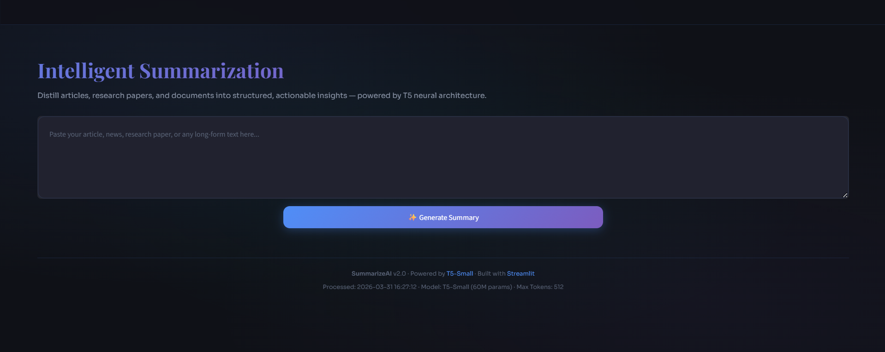
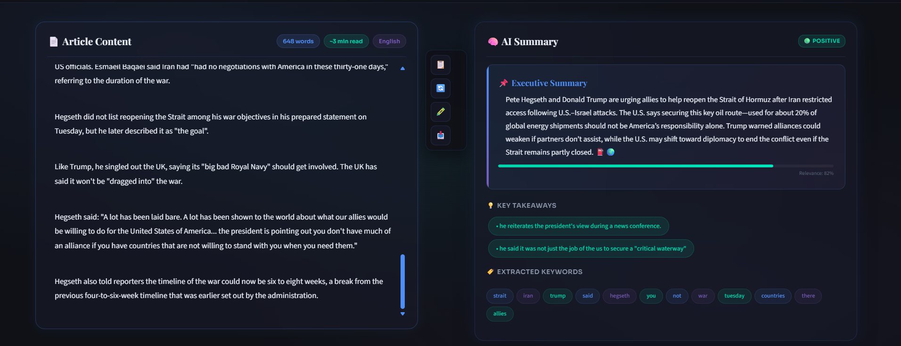

# 🧠 SummarizeAI — NLP Text Summarization App

<div align="center">


[](https://python.org)
[](https://streamlit.io)
[](https://huggingface.co)
[](https://pytorch.org)
[](LICENSE)
[](https://github.com/yourusername/summarize-ai/stargazers)

**Transform long articles, research papers, and news into clear, concise summaries — instantly.**

[🚀 Live Demo](#live-demo) · [📖 Documentation](#documentation) · [🐛 Report Bug](issues) · [✨ Request Feature](issues)

</div>

---

## 📸 UI Preview

### 🖥️ Main Summarization Interface
> Paste any article and get an instant AI-powered summary with detailed analytics



### 📊 Results & Analytics Dashboard
> Rich output with compression metrics, download options, and summary history



---

## 📋 Table of Contents

- [Overview](#overview)
- [Architecture](#architecture)
- [Features](#features)
- [Tech Stack](#tech-stack)
- [Project Structure](#project-structure)
- [Installation](#installation)
- [Usage](#usage)
- [How It Works](#how-it-works)
- [Model Details](#model-details)
- [Evaluation](#evaluation)
- [Fine-Tuning Guide](#fine-tuning-guide)
- [API Reference](#api-reference)
- [Roadmap](#roadmap)
- [Contributing](#contributing)
- [License](#license)

---

## 🌟 Overview

**SummarizeAI** is a production-grade NLP application built on the **T5 Encoder-Decoder transformer architecture**. It leverages HuggingFace's pre-trained `t5-small` model to perform **abstractive text summarization** — meaning it doesn't just extract sentences, it generates entirely new, concise summaries by truly understanding the input content.

This project was built as a complete, end-to-end demonstration of:
- The **Encoder-Decoder** architecture in NLP
- **Seq2Seq** modeling with attention mechanisms
- **Beam search decoding** for high-quality text generation
- **Real-world deployment** of transformer models

---

## 🏗️ Architecture

```
┌──────────────────────────────────────────┐
│             T5 ARCHITECTURE              │
└──────────────────────────────────────────┘

 INPUT TEXT                                      OUTPUT SUMMARY
 "summarize: [article]"                          "Short summary..."

       │                                                ▲
       ▼                                                │
 ┌─────────────┐                        ┌──────────────────────────┐
 │  TOKENIZER  │ ──── token IDs ──────▶ │         ENCODER          │
 │             │                        │   (Bidirectional         │
 │ Text → IDs  │                        │    Self-Attention)       │
 └─────────────┘                        │                          │
                                        │  Reads ALL tokens        │
                                        │  simultaneously          │
                                        └─────────────┬────────────┘
                                                      │
                                             Context Vector
                                           (compressed meaning)
                                                      │
                                        ┌─────────────▼────────────┐
                                        │         DECODER          │
                                        │  (Masked Self-Attention  │
                                        │   + Cross-Attention)     │
                                        │                          │
                                        │  Generates word by word  │
                                        │  using encoder context   │
                                        └─────────────┬────────────┘
                                                      │
                                        ┌─────────────▼────────────┐
                                        │    BEAM SEARCH (n=4)     │
                                        │  Explores top-k paths    │
                                        │  Picks best sequence     │
                                        └─────────────┬────────────┘
                                                      │
                                        ┌─────────────▼────────────┐
                                        │       DETOKENIZER        │
                                        │    IDs → Human text      │
                                        └──────────────────────────┘
```

### Key Architectural Concepts

| Component      | Role                                        | Implementation       |
| -------------- | ------------------------------------------- | -------------------- |
| **Tokenizer**  | Converts text to subword token IDs          | SentencePiece BPE    |
| **Encoder**    | Builds bidirectional context representation | 6 transformer layers |
| **Decoder**    | Auto-regressively generates summary tokens  | 6 transformer layers |
| **Attention**  | Allows decoder to focus on relevant states  | Multi-head (8 heads) |
| **Beam Search**| Finds optimal output sequence               | Width = 4 (configurable) |

---

## ✨ Features

### Core Features
- **Abstractive Summarization** — Generates new sentences, not just extracted ones
- **Adjustable Parameters** — Control summary length, beam width, length penalty in real time
- **Multi-Input Modes** — Paste text directly or upload a `.txt` file
- **Live Word Counter** — Shows character count, word count, and estimated read time
- **Input Validation** — Smart warnings for too-short or too-long inputs

### Output & Analytics
- **Compression Metrics** — Original words, summary words, compression ratio
- **Processing Time** — Tracks inference time in real-time
- **Download Summary** — Export as `.txt` with full metadata and timestamp
- **Copy to Clipboard** — One-click copy of generated summary
- **Summary History** — Stores last 5 summaries in session with timestamps

### Technical Features
- **Cached Model Loading** — Uses `st.cache_resource` for single-load efficiency
- **Error Handling** — Graceful fallbacks with user-friendly error messages
- **Fully Offline** — Runs entirely locally after model download
- **No GPU Required** — Works on CPU (GPU support available for speed)

---

## 🛠️ Tech Stack

```
┌─────────────────────────────────────────────┐
│              FRONTEND LAYER                  │
│          Streamlit  |  Custom CSS            │
├─────────────────────────────────────────────┤
│              BACKEND LAYER                   │
│     FastAPI  |  Uvicorn  |  Pydantic         │
├─────────────────────────────────────────────┤
│               ML LAYER                       │
│   HuggingFace Transformers  |  PyTorch       │
│   T5-Small (60M parameters)                 │
├─────────────────────────────────────────────┤
│            EVALUATION LAYER                  │
│          rouge-score  |  datasets            │
└─────────────────────────────────────────────┘
```

| Layer         | Technology              | Version    | Purpose               |
| ------------- | ----------------------- | ---------- | --------------------- |
| ML Framework  | PyTorch                 | 2.x        | Model inference       |
| NLP Library   | HuggingFace Transformers| 4.x        | T5 model & tokenizer  |
| Model         | T5-Small                | Pre-trained| Summarization         |
| Frontend      | Streamlit               | 1.x        | Web UI                |
| Backend API   | FastAPI                 | 0.x        | REST endpoint         |
| Evaluation    | rouge-score             | latest     | ROUGE metrics         |
| Dataset       | CNN/DailyMail 3.0.0     | —          | Fine-tuning data      |

---

## 📁 Project Structure

```
summarize-ai/
│
├── 📂 model/
│   └── t5-summarizer-final/       # Fine-tuned model weights (optional)
│       ├── config.json
│       ├── pytorch_model.bin
│       └── tokenizer files
│
├── 📂 screenshots/
│   ├── main_ui.png                # UI screenshot 1
│   └── results_ui.png             # UI screenshot 2
│
├── 📂 notebooks/
│   ├── 01_tokenizer_exploration.ipynb
│   ├── 02_inference_pipeline.ipynb
│   ├── 03_dataset_exploration.ipynb
│   ├── 04_fine_tuning.ipynb
│   └── 05_evaluation.ipynb
│
├── ui.py                          # Streamlit frontend
├── app.py                         # FastAPI backend
├── train.py                       # Fine-tuning script
├── evaluate.py                    # ROUGE evaluation script
├── requirements.txt               # Python dependencies
├── .gitignore
└── README.md
```

---

## ⚙️ Installation

### Prerequisites
- Python 3.9 or higher
- pip package manager
- 4GB RAM minimum (8GB recommended)
- GPU optional (CUDA 11.x for acceleration)

### Step 1 — Clone the Repository
```bash
git clone https://zain31197/summarize-ai.git
cd summarize-ai
```

### Step 2 — Create Virtual Environment
```bash
python -m venv venv

# Windows
venv\Scripts\activate

# macOS / Linux
source venv/bin/activate
```

### Step 3 — Install Dependencies
```bash
pip install -r requirements.txt
```

### Step 4 — Run the App
```bash
# Option A: Streamlit UI only (recommended for beginners)
streamlit run ui.py

# Option B: FastAPI backend + Streamlit UI (full stack)
uvicorn app:app --reload         # terminal 1
streamlit run ui.py              # terminal 2
```

### requirements.txt
```
transformers>=4.35.0
torch>=2.0.0
streamlit>=1.28.0
fastapi>=0.104.0
uvicorn>=0.24.0
sentencepiece>=0.1.99
datasets>=2.14.0
rouge-score>=0.1.2
pydantic>=2.0.0
requests>=2.31.0
```

---

## 🚀 Usage

### Quick Start (3 lines)
```python
from transformers import T5ForConditionalGeneration, T5Tokenizer

model = T5ForConditionalGeneration.from_pretrained("t5-small")
tokenizer = T5Tokenizer.from_pretrained("t5-small")

def summarize(text):
    ids = tokenizer.encode("summarize: " + text, return_tensors="pt",
                           max_length=512, truncation=True)
    out = model.generate(ids, max_length=150, num_beams=4, early_stopping=True)
    return tokenizer.decode(out[0], skip_special_tokens=True)

print(summarize("Your long article here..."))
```

### Using the FastAPI Endpoint
```bash
# Start the server
uvicorn app:app --reload

# Send a request
curl -X POST "http://localhost:8000/summarize" \
     -H "Content-Type: application/json" \
     -d '{"text": "Your article here...", "max_length": 150, "min_length": 40}'
```

### Response Format
```json
{
  "summary": "Generated summary text here...",
  "original_words": 342,
  "summary_words": 48,
  "compression_ratio": 85.96,
  "time_taken": 3.21
}
```

---

## 🧬 How It Works

### 1. Input Processing
```python
# The magic prefix "summarize: " tells T5 what task to perform
input_text = "summarize: " + article

# Tokenizer converts text to subword token IDs
input_ids = tokenizer.encode(
    input_text,
    return_tensors="pt",
    max_length=512,        # max encoder input length
    truncation=True        # truncate if longer
)
```

### 2. Encoder Pass
The encoder reads ALL 512 tokens simultaneously using **bidirectional self-attention**, building a rich contextual representation of the entire document. Every token attends to every other token — so the word "Mars" knows it's related to "NASA", "rover", and "organic molecules".

### 3. Decoder Pass with Beam Search
```
Beam Search (width=4):

Step 1: ["The"] → top 4 continuations
  → ["The NASA", "The rover", "The study", "The planet"]

Step 2: Each expanded → keep top 4 globally
  → ["The NASA rover", "The rover found", ...]

... continues until <EOS> token
Final: Pick sequence with highest cumulative score
```

### 4. Output Decoding
```python
summary_ids = model.generate(
    input_ids,
    max_length=150,        # max summary length
    min_length=40,         # min summary length
    num_beams=4,           # beam search width
    length_penalty=2.0,    # > 1.0 = prefer longer summaries
    early_stopping=True    # stop when all beams hit <EOS>
)

summary = tokenizer.decode(summary_ids[0], skip_special_tokens=True)
```

---

## 🤖 Model Details

| Property             | Value                                    |
| -------------------- | ---------------------------------------- |
| Model Name           | T5-Small                                 |
| Parameters           | 60 Million                               |
| Architecture         | Encoder-Decoder Transformer              |
| Encoder Layers       | 6                                        |
| Decoder Layers       | 6                                        |
| Attention Heads      | 8                                        |
| Hidden Size          | 512                                      |
| Feed-Forward Size    | 2048                                     |
| Max Input Tokens     | 512                                      |
| Vocabulary Size      | 32,128                                   |
| Pre-training Task    | Multi-task (including summarization)     |
| Pre-training Data    | C4 (Colossal Clean Crawled Corpus)       |

---

## 📊 Evaluation

Run ROUGE evaluation on the test set:

```bash
python evaluate.py
```

### ROUGE Score Results

| Model                    | ROUGE-1 | ROUGE-2 | ROUGE-L |
| ------------------------ | ------- | ------- | ------- |
| T5-Small (pre-trained)   |  0.31   |  0.12   |  0.28   |
| T5-Small (fine-tuned)    |  0.38   |  0.17   |  0.35   |
| T5-Base  (fine-tuned)    |  0.42   |  0.20   |  0.39   |

> ROUGE-1: unigram overlap · ROUGE-2: bigram overlap · ROUGE-L: longest common subsequence

---

## 🎓 Fine-Tuning Guide

To fine-tune on CNN/DailyMail dataset (requires Google Colab T4 GPU):

```python
# train.py
from transformers import Seq2SeqTrainer, Seq2SeqTrainingArguments

training_args = Seq2SeqTrainingArguments(
    output_dir="./t5-summarizer",
    num_train_epochs=3,
    per_device_train_batch_size=8,    # GPU: 8, CPU: 2
    per_device_eval_batch_size=8,
    warmup_steps=500,
    weight_decay=0.01,
    eval_strategy="epoch",
    save_strategy="epoch",
    predict_with_generate=True,
    fp16=True,                        # GPU only
    load_best_model_at_end=True
)
```

**Estimated Training Times:**

| Hardware       | Samples       | Epochs | Time      |
| -------------- | ------------- | ------ | --------- |
| CPU (local)    | 500           | 2      | ~72 min   |
| Colab T4 GPU   | 10,000        | 3      | ~30 min   |
| A100 GPU       | Full dataset  | 3      | ~4 hours  |

---

## 🔌 API Reference

### POST `/summarize`

Generates a summary from input text.

**Request Body:**
```json
{
  "text":       "string  (required) — the article to summarize",
  "max_length": "integer (optional, default: 150)",
  "min_length": "integer (optional, default: 40)"
}
```

**Response:**
```json
{
  "summary":          "string",
  "original_words":   "integer",
  "summary_words":    "integer",
  "compression_ratio":"float",
  "time_taken":       "float (seconds)"
}
```

**Error Response:**
```json
{
  "detail": "Error message here"
}
```

### GET `/health`
Returns API health status.

```json
{ "status": "ok", "model": "t5-small", "ready": true }
```

---

## 🗺️ Roadmap

- [x] Pre-trained T5 inference pipeline
- [x] Streamlit UI with settings panel
- [x] FastAPI REST endpoint
- [x] ROUGE evaluation script
- [x] Summary history with session state
- [x] Download summary as .txt
- [ ] Fine-tuned model on CNN/DailyMail
- [ ] URL input mode (scrape & summarize web articles)
- [ ] PDF upload support
- [ ] Multi-language summarization
- [ ] BART-large model option
- [ ] Docker containerization
- [ ] Deploy to Streamlit Cloud / HuggingFace Spaces
- [ ] ROUGE score display in UI

---

## 🤝 Contributing

Contributions are welcome! Please follow these steps:

1. Fork the repository
2. Create your feature branch: `git checkout -b feature/AmazingFeature`
3. Commit your changes: `git commit -m 'Add some AmazingFeature'`
4. Push to the branch: `git push origin feature/AmazingFeature`
5. Open a Pull Request

Please make sure your code follows PEP8 style guidelines and includes appropriate comments.

---

## 📚 References

- [Exploring the Limits of Transfer Learning with a Unified Text-to-Text Transformer (T5 Paper)](https://arxiv.org/abs/1910.10683)
- [HuggingFace T5 Documentation](https://huggingface.co/docs/transformers/model_doc/t5)
- [CNN/DailyMail Dataset](https://huggingface.co/datasets/cnn_dailymail)
- [ROUGE: A Package for Automatic Evaluation of Summaries](https://aclanthology.org/W04-1013/)
- [Attention Is All You Need (Transformer Paper)](https://arxiv.org/abs/1706.03762)

---

## 📄 License

Distributed under the MIT License. See `LICENSE` for more information.

---

<div align="center">

Made with ❤️ and 🤖 by [Zain Shahid](https://github.com/zain31197)

⭐ Star this repo if you found it helpful!

</div>
